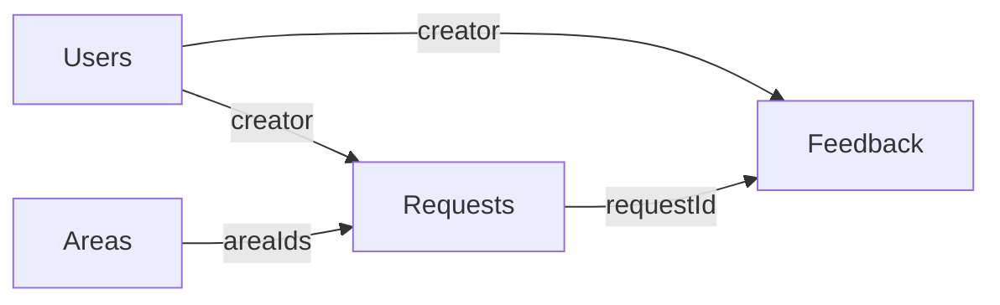

## Overview

GTM Feedback uses **Drizzle ORM** with **PostgreSQL** (recommended: Neon) for all database operations.

<Info>
  **Critical**: This project uses Drizzle Relational Query Builder (RQB) syntax exclusively. Never use `db.select()` patterns.
</Info>

## Database Schema

The schema is located in `packages/database/src/schema.ts`.

### Core Tables

<CardGroup cols={2}>
  <Card title="users" icon="user">
    User accounts with authentication and admin flags
  </Card>
  
  <Card title="requests" icon="lightbulb">
    Feature requests with areas, status, and links
  </Card>
  
  <Card title="feedback" icon="comment">
    Customer-specific feedback linked to accounts/opportunities
  </Card>
  
  <Card title="areas" icon="layer-group">
    Product areas for categorization
  </Card>
  
  <Card title="sfdcAccounts" icon="building">
    Salesforce account data (ARR, enterprise status)
  </Card>
  
  <Card title="sfdcOpportunities" icon="handshake">
    Salesforce opportunities with ARR and stages
  </Card>
</CardGroup>

### Schema Example

<CodeGroup>
```typescript Users Table
export const users = pgTable(
  "users",
  {
    id: uuid().defaultRandom().primaryKey().notNull(),
    name: text("name").notNull(),
    email: text("email").unique().notNull(),
    image: text("image"),
    avatar: text("avatar"),
    emailVerified: timestamp("emailVerified", { mode: "date" }),
    isAdmin: boolean("is_admin").default(false).notNull(),
  },
  (table) => [unique("users_email_key").on(table.email)],
);
```

```typescript Feedback Table
export const feedback = pgTable(
  "feedback",
  {
    id: uuid().defaultRandom().primaryKey().notNull(),
    requestId: uuid("request_id").notNull(),
    accountId: text("account_id").notNull(),
    opportunityId: text("opportunity_id"),
    severity: severityEnum("severity").notNull(),
    description: text("description").notNull(),
    creator: uuid("creator").notNull(),
    createdAt: timestamp("created_at", {
      withTimezone: true,
      mode: "string",
    }).defaultNow().notNull(),
    externalLinks: text("external_links")
      .array()
      .notNull()
      .default(sql`ARRAY[]::text[]`),
    slug: text("slug"),
    creationSource: feedbackCreationSourceEnum("creation_source")
      .default("manual")
      .notNull(),
    metadata: jsonb("metadata"),
  }
);
```

```typescript Enums
export const requestStatusEnum = pgEnum("request_status", [
  "open",
  "shipped",
  "deprioritized",
]);

export const severityEnum = pgEnum("severity", ["low", "medium", "high"]);

export const feedbackCreationSourceEnum = pgEnum("feedback_creation_source", [
  "manual",
  "agent",
]);
```
</CodeGroup>

## Relational Query Builder (RQB)

<Warning>
  **Critical**: Always use Drizzle Relational Query Builder (RQB) syntax. Never use `db.select()` patterns.
</Warning>

### Correct Pattern: Using Query Engine

<CodeGroup>
```typescript Find Many with Relations
import { db } from "@feedback/db";

// find many with relations
const feedback = await db.query.feedback.findMany({
  with: {
    user: true,
    entries: {
      with: { user: true },
      orderBy: (entries, { desc }) => [desc(entries.createdAt)]
    },
    comments: {
      orderBy: (comments, { desc }) => [desc(comments.createdAt)],
      limit: 10
    }
  },
  where: (feedback, { eq, and, isNotNull }) => and(
    eq(feedback.status, 'open'),
    isNotNull(feedback.creator)
  ),
  orderBy: (feedback, { desc }) => [desc(feedback.updatedAt)]
});
```

```typescript Find First/Single Record
import { db } from "@feedback/db";

// find first/single record
const feedback = await db.query.feedback.findFirst({
  where: (feedback, { eq }) => eq(feedback.id, feedbackId),
  with: { 
    user: true, 
    entries: true, 
    comments: { with: { user: true } } 
  }
});
```

```typescript Complex Filtering
import { db } from "@feedback/db";

const requests = await db.query.requests.findMany({
  where: (requests, { eq, and, or, inArray, isNotNull }) => and(
    eq(requests.status, 'open'),
    or(
      inArray(requests.areaIds, ['area-1', 'area-2']),
      isNotNull(requests.linearUrl)
    )
  ),
  with: {
    creator: true,
    feedback: {
      with: { user: true },
      orderBy: (feedback, { desc }) => [desc(feedback.createdAt)]
    }
  },
  orderBy: (requests, { desc }) => [desc(requests.updatedAt)],
  limit: 50
});
```
</CodeGroup>

### Incorrect Pattern: Never Use This

<CodeGroup>
```typescript ❌ NEVER DO THIS
import { db } from "@feedback/db";
import { eq } from "drizzle-orm";
import { Feedback } from "@feedback/db/schema";

// NEVER use db.select() syntax
const result = await db.select().from(Feedback).where(eq(Feedback.id, id));
```
</CodeGroup>

## Database Relations

Understanding the relationship patterns:

### One-to-Many Relationships



<Tabs>
  <Tab title="Users → Feedback">
    One user creates many feedback items:
    
    ```typescript
    const user = await db.query.users.findFirst({
      where: (users, { eq }) => eq(users.id, userId),
      with: {
        feedback: {
          orderBy: (feedback, { desc }) => [desc(feedback.createdAt)],
          limit: 10
        }
      }
    });
    ```
  </Tab>
  
  <Tab title="Requests → Feedback">
    One request has many feedback items:
    
    ```typescript
    const request = await db.query.requests.findFirst({
      where: (requests, { eq }) => eq(requests.id, requestId),
      with: {
        feedback: {
          with: { user: true },
          orderBy: (feedback, { desc }) => [desc(feedback.createdAt)]
        }
      }
    });
    ```
  </Tab>
  
  <Tab title="Accounts → Opportunities">
    One account has many opportunities:
    
    ```typescript
    const account = await db.query.sfdcAccounts.findFirst({
      where: (accounts, { eq }) => eq(accounts.id, accountId),
      with: {
        opportunities: {
          orderBy: (opps, { desc }) => [desc(opps.arr)]
        }
      }
    });
    ```
  </Tab>
</Tabs>

## Migrations

### Configuration

Drizzle is configured in `packages/database/drizzle.config.ts`:

```typescript
import "dotenv/config";
import { defineConfig } from "drizzle-kit";

export default defineConfig({
  dialect: "postgresql",
  schema: "./src/schema.ts",
  out: "./drizzle/migrations",
  strict: true,
  verbose: true,
  dbCredentials: {
    url: process.env.DATABASE_URL ?? "",
  },
});
```

### Applying Schema Changes

<Steps>
  <Step title="Push schema changes">
    For development, use `db:push` to sync schema without migrations:
    
    ```bash
    pnpm db:push
    ```
    
    This is the recommended approach for local development.
  </Step>

  <Step title="Generate migrations (production)">
    For production deployments, generate migration files:
    
    ```bash
    cd packages/database
    pnpm drizzle-kit generate
    ```
  </Step>

  <Step title="Apply migrations">
    Apply generated migrations:
    
    ```bash
    pnpm drizzle-kit migrate
    ```
  </Step>
</Steps>

<Info>
  The `db:push` command is filtered to run in the `www` workspace: `pnpm --filter www db:push`
</Info>

## Seeding Data

The seed script populates demo data for local development:

```bash
pnpm db:seed
```

This script:

1. Creates demo users
2. Creates product areas
3. Populates feature requests
4. Generates sample feedback
5. Creates embeddings (if AI configured)
6. Links accounts and opportunities

<Tip>
  Seeding is optional but helpful for testing the full application flow.
</Tip>

## Query Patterns from CLAUDE.md

Follow these established patterns from the codebase:

### Pattern 1: Simple Queries

```typescript
// fetch single record by ID
const request = await db.query.requests.findFirst({
  where: (requests, { eq }) => eq(requests.id, requestId)
});

// fetch with basic filtering
const openRequests = await db.query.requests.findMany({
  where: (requests, { eq }) => eq(requests.status, 'open'),
  orderBy: (requests, { desc }) => [desc(requests.updatedAt)]
});
```

### Pattern 2: Eager Loading Relations

```typescript
// load related data in a single query
const feedback = await db.query.feedback.findFirst({
  where: (feedback, { eq }) => eq(feedback.id, feedbackId),
  with: {
    user: true,  // load creator
    request: {   // load request with its creator
      with: { user: true }
    },
    comments: {  // load comments with pagination
      with: { user: true },
      orderBy: (comments, { desc }) => [desc(comments.createdAt)],
      limit: 10
    }
  }
});
```

### Pattern 3: Complex Filtering

```typescript
// combine multiple conditions
const results = await db.query.feedback.findMany({
  where: (feedback, { eq, and, or, gte, inArray }) => and(
    eq(feedback.severity, 'high'),
    or(
      inArray(feedback.accountId, accountIds),
      gte(feedback.createdAt, thirtyDaysAgo)
    )
  ),
  with: { user: true, request: true }
});
```

### Pattern 4: Ordering and Limiting

```typescript
// sort and paginate results
const recentFeedback = await db.query.feedback.findMany({
  where: (feedback, { eq }) => eq(feedback.requestId, requestId),
  with: { user: true },
  orderBy: (feedback, { desc }) => [desc(feedback.createdAt)],
  limit: 20,
  offset: page * 20
});
```

## Common Operations

<AccordionGroup>
  <Accordion title="Insert new records">
    ```typescript
    import { db } from "@feedback/db";
    import { feedback } from "@feedback/db/schema";
    
    const [newFeedback] = await db.insert(feedback)
      .values({
        requestId,
        accountId,
        severity: 'high',
        description: 'Customer needs this feature',
        creator: userId,
      })
      .returning();
    ```
  </Accordion>

  <Accordion title="Update existing records">
    ```typescript
    import { db } from "@feedback/db";
    import { requests } from "@feedback/db/schema";
    import { eq } from "drizzle-orm";
    
    await db.update(requests)
      .set({ 
        status: 'shipped',
        updatedAt: new Date().toISOString()
      })
      .where(eq(requests.id, requestId));
    ```
  </Accordion>

  <Accordion title="Delete records">
    ```typescript
    import { db } from "@feedback/db";
    import { feedback } from "@feedback/db/schema";
    import { eq } from "drizzle-orm";
    
    await db.delete(feedback)
      .where(eq(feedback.id, feedbackId));
    ```
  </Accordion>

  <Accordion title="Count records">
    ```typescript
    import { db } from "@feedback/db";
    import { requests } from "@feedback/db/schema";
    import { eq, count } from "drizzle-orm";
    
    const [result] = await db
      .select({ count: count() })
      .from(requests)
      .where(eq(requests.status, 'open'));
    ```
  </Accordion>
</AccordionGroup>

## Best Practices

<CardGroup cols={2}>
  <Card title="Use RQB Syntax" icon="check">
    Always use `db.query.tableName` patterns, never `db.select()`
  </Card>
  
  <Card title="Eager Load Relations" icon="link">
    Use `with` clause to avoid N+1 queries
  </Card>
  
  <Card title="Type Safety" icon="shield">
    Let TypeScript infer types from Drizzle queries
  </Card>
  
  <Card title="Indexes" icon="bolt">
    Use indexes for frequently queried fields (defined in schema)
  </Card>
</CardGroup>

## Troubleshooting

<AccordionGroup>
  <Accordion title="Connection errors">
    Verify your `DATABASE_URL` environment variable:
    
    ```bash
    echo $DATABASE_URL
    ```
    
    Test the connection:
    
    ```bash
    psql $DATABASE_URL
    ```
  </Accordion>

  <Accordion title="Migration conflicts">
    If migrations are out of sync:
    
    ```bash
    # Reset local database (dev only!)
    pnpm db:push
    pnpm db:seed
    ```
  </Accordion>

  <Accordion title="Type errors with queries">
    Ensure you're using the callback syntax for `where` and `orderBy`:
    
    ```typescript
    // correct
    where: (table, { eq }) => eq(table.id, id)
    
    // incorrect
    where: eq(table.id, id)
    ```
  </Accordion>
</AccordionGroup>

## Next Steps

<CardGroup cols={2}>
  <Card title="Workflows" icon="workflow" href="/development/workflows">
    Learn about background workflows
  </Card>
  
  <Card title="Contributing" icon="code-branch" href="/development/contributing">
    Read contribution guidelines
  </Card>
</CardGroup>