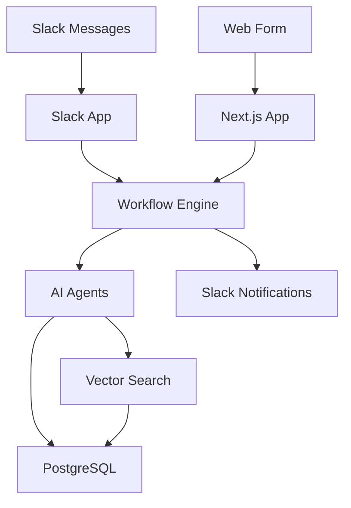

GTM Feedback is a full-stack reference architecture for collecting, triaging, and reporting product feedback from your go-to-market teams. The system uses AI agents to automatically match customer feedback to existing feature requests, create new requests when needed, and generate insights reports for product areas.

<Note>
This is a **reference architecture** designed to be adapted to your organization's specific needs. View the [live demo](https://oss.feedback.vercel.zone/) to see it in action.
</Note>

## What it does

GTM Feedback bridges the gap between your field teams (sales, customer success, support) and your product organization by:

- **Capturing feedback** from multiple entry points (Slack reactions, web forms, API submissions)
- **Automatically triaging** feedback using AI-powered semantic matching to existing feature requests
- **Coordinating approvals** through human-in-the-loop workflows when AI confidence is medium
- **Generating insights** with AI agents that analyze product areas and create structured reports
- **Surfacing trends** by tracking which customers care about which features, weighted by ARR

## Why it exists

Product teams often struggle with fragmented feedback across Slack threads, support tickets, and scattered spreadsheets. GTM Feedback solves this by:

- Providing a **single source of truth** for customer feature requests
- Using **AI to reduce manual work** in matching and categorizing feedback
- Maintaining **human oversight** for important decisions through Slack approvals
- Enabling **data-driven prioritization** based on customer ARR and request frequency

## Key features

<CardGroup cols={2}>
  <Card title="Multiple entry points" icon="inbox">
    Capture feedback via Slack reactions, form submissions, or web UI
  </Card>
  <Card title="AI-powered matching" icon="sparkles">
    Uses semantic search with vector embeddings to match feedback to existing feature requests
  </Card>
  <Card title="Intelligent triaging" icon="filter">
    Three-tier confidence system: auto-add (≥0.9), human approval (0.8-0.9), or create new (&lt;0.8)
  </Card>
  <Card title="Human-in-the-loop" icon="users">
    Slack integration for approval workflows and notifications
  </Card>
  <Card title="Area insights" icon="chart-line">
    AI agent generates structured insights reports for product areas
  </Card>
  <Card title="Durable workflows" icon="rotate">
    Background processing with Workflow DevKit for reliable execution
  </Card>
</CardGroup>

## Architecture

The system uses a modern tech stack designed for reliability and developer experience:



<Note>
See the [architecture diagram](https://github.com/user-attachments/assets/db52c1ba-c009-485d-a355-a23564d04df5) in the repository for a detailed visual overview.
</Note>

### Tech stack

- **Framework**: Next.js 16 with App Router
- **Durable Execution**: [Workflow DevKit](https://useworkflow.dev/)
- **AI**: Vercel AI SDK with AI Gateway
- **Human-in-the-Loop**: Slack Bolt + Vercel Slack Bolt adapter
- **Vector Search**: Upstash Vector with OpenAI embeddings
- **Database**: PostgreSQL with Drizzle ORM
- **Caching**: Redis/Upstash KV
- **UI**: shadcn/ui, Tailwind CSS v4, Radix UI
- **Authentication**: NextAuth v5 with Google OAuth

## How it works

### 1. Feedback collection

Feedback enters the system through multiple channels:

- **Slack**: Users react to messages with a 💎 emoji, triggering the Slack app to capture the thread
- **Web form**: Authenticated users submit feedback through the web UI
- **API**: External systems can submit feedback programmatically

### 2. AI-powered matching

When feedback arrives, a durable workflow:

1. Generates a vector embedding of the feedback content
2. Performs semantic search against existing feature requests
3. Uses an AI agent to evaluate match quality and assign a confidence score
4. Routes based on confidence:
   - **High confidence (≥0.9)**: Automatically adds to existing request
   - **Medium confidence (0.8-0.9)**: Sends to Slack for human approval
   - **Low confidence (&lt;0.8)**: Creates new feature request proposal

### 3. Human oversight

For medium-confidence matches and new request proposals, the workflow:

1. Posts an interactive message to Slack with context
2. Waits for human approval or rejection
3. Processes the decision and updates the database
4. Notifies relevant stakeholders

### 4. Insights generation

Periodically, an AI agent analyzes each product area to:

- Identify top requests by customer count and ARR
- Surface emerging themes and patterns
- Generate structured insights reports
- Highlight requests that cross multiple product areas

## Project structure

The repository is organized as a monorepo with apps and shared packages:

```
gtm-feedback/
├── apps/
│   ├── www/                    # Next.js web application
│   │   ├── src/
│   │   │   ├── app/            # Next.js app router pages
│   │   │   ├── components/     # React components
│   │   │   ├── workflows/      # Workflow DevKit workflows
│   │   │   └── lib/            # Shared utilities, queries, actions
│   │   └── scripts/            # Seed scripts
│   └── slack-app/              # Slack Bolt application
│       └── server/
│           ├── api/            # API routes
│           ├── listeners/      # Slack event/action listeners
│           └── lib/            # Slack utilities, AI integration
├── packages/
│   ├── ai/                     # Shared AI package
│   │   └── src/
│   │       ├── agents/         # AI SDK agents
│   │       ├── tools/          # Agent tools
│   │       └── embeddings/     # Vector embedding utilities
│   ├── database/               # Drizzle ORM schema
│   └── redis/                  # Redis/Upstash helpers
└── README.md
```

## Next steps

<CardGroup cols={2}>
  <Card title="Quickstart" icon="rocket" href="/quickstart">
    Deploy GTM Feedback to Vercel and set up your first instance
  </Card>
  <Card title="Configuration" icon="gear" href="/deployment/environment-variables">
    Configure authentication, AI providers, and integrations
  </Card>
  <Card title="Slack Integration" icon="slack" href="/deployment/slack-app">
    Set up the optional Slack app for reaction-based feedback capture
  </Card>
  <Card title="Contributing" icon="code" href="/development/contributing">
    Learn how to customize and extend the system for your needs
  </Card>
</CardGroup>
